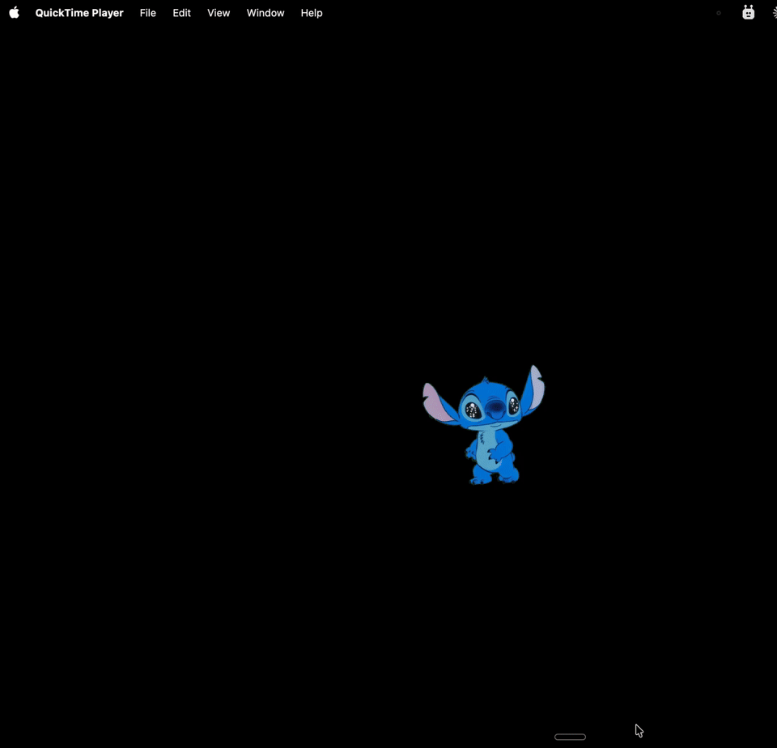

# StitchAgent

Desktop pet + Claude CLI on macOS.

Stitch walks around your desktop.  
Click Stitch to open a Claude chat box.  
Hover Stitch to interact.

## What It Does

- Live Stitch pet on your desktop
- Random walking + hover reactions
- Click to open a Claude-style chat popover
- Draggable chat box (stays where you drop it)
- Sound effects + style options + display options

## Requirements

- macOS 14+
- [Claude Code CLI](https://claude.ai/download)

## Quick Start

1. Go to [Releases](https://github.com/suzyzou/stitch-agent/releases)
2. Download the latest `.dmg`
3. Open the DMG and move `StitchAgent` to `Applications`
4. Launch `StitchAgent` from `Applications`

Or build from source:
1. Open `stitch-agent.xcodeproj` in Xcode
2. Run the `StitchAgent` target
3. Look at your menu bar for `StitchAgent`

## Privacy

- Local-first app
- No account, no analytics
- Chat runs through your local Claude CLI process

