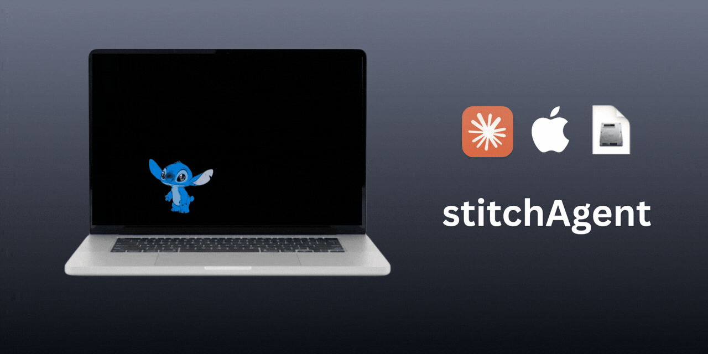

# claude-pet

Desktop pet + Claude CLI on macOS.

claude-pet walks around your desktop.  
Click claude-pet to open a Claude chat box.  
Hover claude-pet to interact.

## What It Does

- Live Stitch pet on your desktop
- Random walking + hover reactions
- Click to open a Claude-style chat popover
- Draggable chat box (stays where you drop it)
- Sound effects + style options + display options

## Requirements

- macOS 14+
- [Claude Code CLI](https://claude.ai/download)

## Quick Start

1. Go to [Releases](https://github.com/freyzo/stitchAgent/releases)
2. Download the latest `.dmg`
3. Open the DMG and move `claude-pet` to `Applications`
4. Launch `claude-pet` from `Applications`

Or build from source:
1. Open `claude-pet.xcodeproj` in Xcode
2. Run the app build (target builds `claude-pet.app`)
3. Look at your menu bar for `claude-pet`

## Privacy

- Local-first app
- No account, no analytics
- Chat runs through your local Claude CLI process

